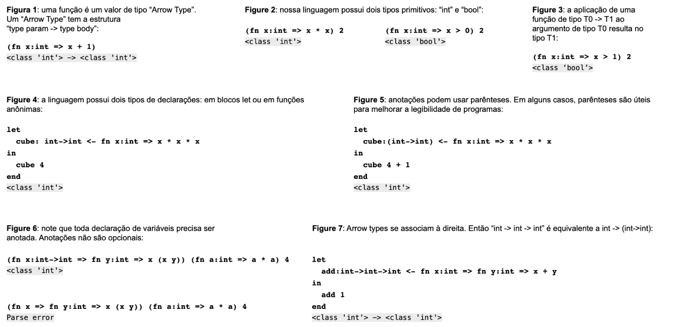
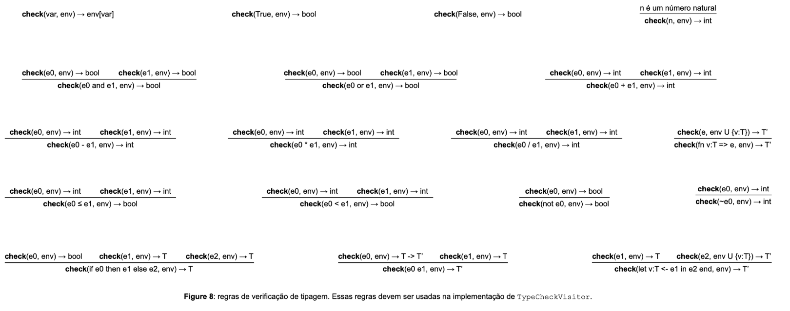
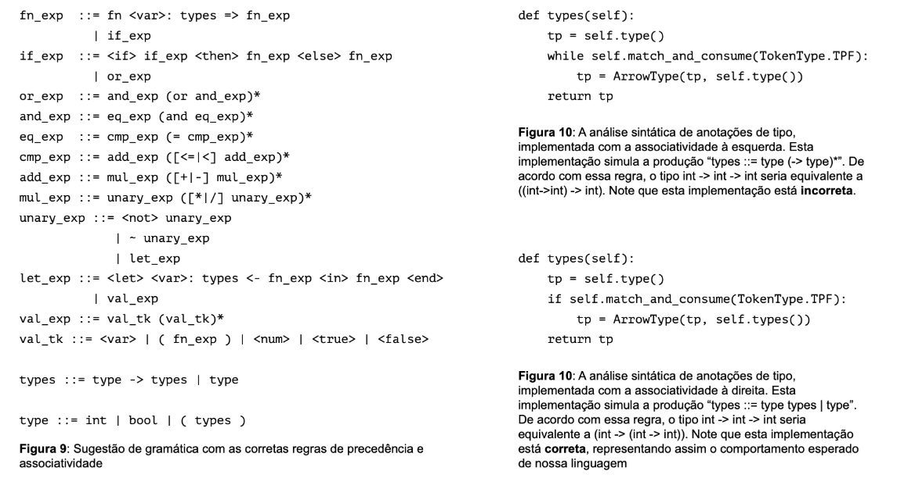

# Type Checking

### Overview

The goal of this assignment is to add type annotations and a type-checking system to our mini-language of anonymous functions.
Type annotations apply to variable declarations, which can occur in two forms in our language: inside **let** blocks or within **fn** definitions.

The figure below illustrates some example programs using type annotations:



---
### Objectives

In this assignment, you have two main goals:

- Modify the language syntax to incorporate type annotations.

- Implement a visitor that performs type checking according to the typing rules.

The expected changes are described below.

---

**Expressions**

Two expressions will be modified: **Let** and **Fn**.
However, these modifications are already implemented for you.
In other words, you do not need to modify ``Expression.py``.

**What has changed?**

Both **Let** and **Fn** now include a type annotation for the variable they declare:

```Python
class Fn(Expression):
    def __init__(self, formal, tp_var, body):
        self.formal = formal
        self.tp_var = tp_var
        self.body = body

class Let(Expression):
    def __init__(self, identifier, tp_var, exp_def, exp_body):
        self.identifier = identifier
        self.tp_var = tp_var
        self.exp_def = exp_def
        self.exp_body = exp_body
```

Note that the initializer methods now include a parameter ``tp_var``,
which denotes the type of the declared variable.

Examples:

```Python
# Declares f : int => y + x
e0 = Fn('y', type(1), Add(Var('y'), Var('x')))

# Declares let v : int <- 2 in v + 3 end
e = Let('v', type(1), Num(2), Add(Var('v'), Num(3)))
```

---

**Visitor**

You must implement the class ``TypeCheckVisitor``, which performs type checking according to the rules in Figure 8.

Just like in the anonymous functions exercise, each method in this new visitor receives a context (environment).
However, this context does not map variable names to values, instead, it maps variable names to types.

Example:
```Python
e = Var('t')
ev = TypeCheckVisitor()
e.accept(ev, {'t': type(1)})
<class 'int'>
```

The figure below illustrates the typing rules used in this exercise:



---
**Lexical Analysis**

The lexer (``Lexer.py``) must be modified to include four new tokens related to type annotations:

These new tokens are already declared in ``Lexer.py``,
but you must extend your previous implementation (from the anonymous functions assignment) to correctly recognize these strings as tokens.

---
**Syntax Analysis**

The parser (``Parser.py``) must be modified to include type annotations in the grammar.
A suggested grammar is shown in Figure 9:



---
### Submission and Testing

You must **not** modify ``driver.py`` or ``expression.py``

To test your implementation locally, run:

```Bash
python3 driver.py
```

Then type the following program:
```sml
(fn x: int => x * x) (4 - 1)
# Press CTRL+D
```
Expected output:
```bash
<class 'int'>
```

Each file contains doctests that validate your implementation.
To run them, use:
```bash
python3 -m doctest filename.py
```

For example:

```bash
python3 -m doctest Visitor.py
```

If no error messages are displayed, your implementation is (almost) complete!