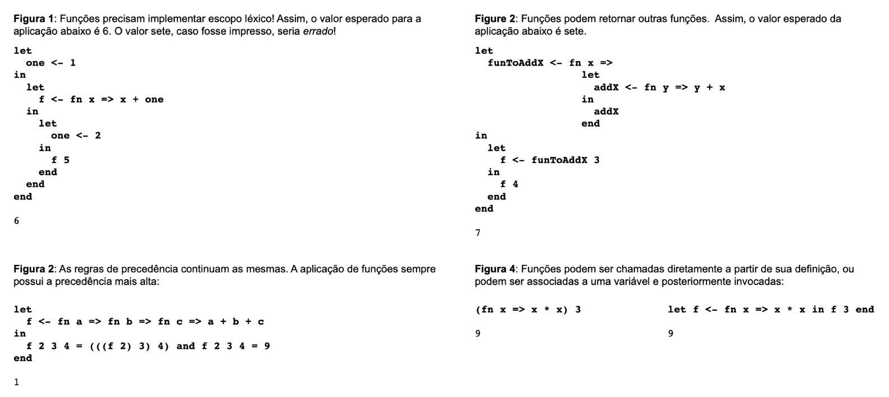
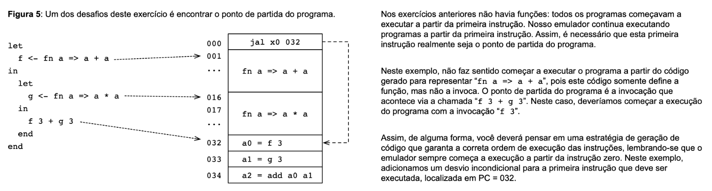

## Code Generation For Functions

### Overview

The goal of this assignment is to **generate** code for expressions containing anonymous functions.

To achieve this, we extend our RISC-V subset from previous labs with three new instructions:

- ``jalr rd, rs1, offset``

    Saves ``PC + 1`` into register ``rd`` and sets ``PC = rs1 + offset``.

    If ``rd = x0``, this behaves as an indirect goto, since writing to ``x0`` has no effect.

- ``sw reg, rs1(offset)``

    Stores the 32-bit value from ``reg`` into memory at address ``rs1 + offset``.

- ``ld reg, rs1(offset)``

    Loads into ``reg`` the 32-bit value from memory at address ``rs1 + offset``.

---
### Memory Model

Programs now have memory, which can be seen as an array of 32-bit integers.
Values can be read and written using the ``ld`` and ``sw`` instructions.

Programs also have a stack pointer register (``sp``), initialized with the size of the available memory.
You can use sp to manage a stack of activation records for function calls.

Use the following API to add memory access instructions:

```Python
prog.add_inst(Lw("rs1", offset, "reg"))  # Implements ld reg, rs1(offset)
prog.add_inst(Sw("rs1", offset, "reg"))  # Implements sw reg, rs1(offset)
```

---
### New Expressions

You must extend the RenameVisitor and GenVisitor classes (in ``Visitor.py``) to handle two new expressions:

- ``e0 e1`` → invokes the function ``e0`` with argument ``e1``

- ``(fn v => e)`` → creates a function with parameter ``v`` and body ``e``

The figures below (Figures 1–4) illustrate different aspects of function implementation.



Because programs may now contain multiple functions, your generated code must also identify the correct boot point (entry point) of execution.
The figure below illustrates this challenge:



---
### Implementing Functions

This exercise requires you to implement a stack to manage function calls.

Even though we do not allow recursive functions, our anonymous functions are always invoked indirectly, meaning you must store the function address in a register and jump using ``jalr``.

Each function receives a single parameter and returns a single value.
We follow the RISC-V calling convention:

- The parameter is passed in register ``a0``.

- The return value is also stored in register ``a0``.
---
Example: Function Generation (``visit_fn``)
```Python
def visit_fn(self, exp, prog):
    # 1. Prologue: Allocate space on the stack and save the return address (ra).
    # 2. Pass the value in a0 to the formal parameter variable.
    # 3. Generate code for the function body and get the return variable.
    # 4. Epilogue: Restore 'ra' and adjust the stack.
    # 5. Return to the caller using a jump (jalr) with the saved 'ra' value.
```

Use the stack pointer (``sp``) to manage stack frames.

- The ``sp`` register is initialized to the size of memory.

- The top of the stack starts at ``sp - 1``.

- To push data:

    1. Decrement ``sp``.

    2. Use ``sw`` to store the value at ``[sp]``.

- To pop data:

    1. Use ``ld`` to load from ``[sp]``.

    2. Increment ``sp``.

This ensures that each function in RISC-V is self-contained in terms of stack and return address management.

---
Example: Function Application (``visit_app`)

```Python
def visit_app(self, exp, prog):
    # 1. Generate instructions to evaluate the target function expression.
    # 2. Generate code to compute the argument expression.
    # 3. Use 'jalr' to jump to the function address.
    #    (jalr automatically saves the return address in a register.)
    # 4. Retrieve the function's return value from register a0.
```
Using this convention keeps the stack consistent and simplifies nested function calls.

---
### Submission and Testing

This assignment builds on VPL 12.

Do not modify ``Asm.py``, ``driver.py``, or ``Expression.py``.

To test your implementation locally, run:

```Bash
python3 driver.py
```

Example program:

```sml
true and false
# Press CTRL+D
```

Expected output:
```Bash
0
```

Each file contains doctests that validate your implementation.
To run them, use:
```bash
python3 -m doctest filename.py
```

For example:

```bash
python3 -m doctest Visitor.py
```

If no errors appear, your implementation is (almost) complete.