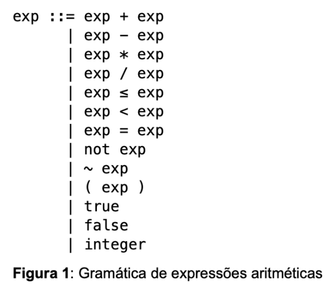
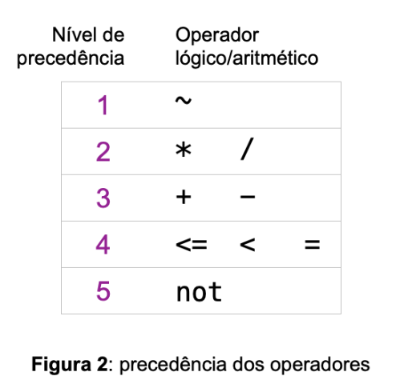
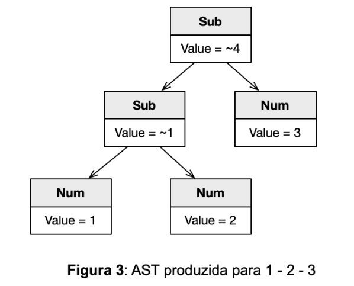
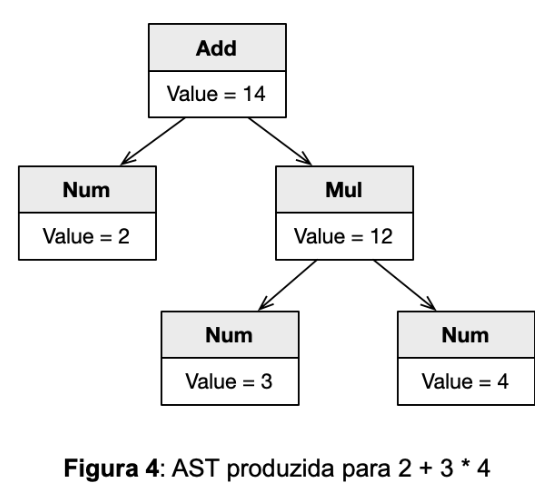

# Arithmetic Expression Parser

### Overview
The objective of this exercise is to implement a parser for arithmetic expressions.  
In this assignment, we will use a subset of the arithmetic expressions of the COOL language.  
**Figure 1** shows the grammar that recognizes these expressions.  
Your task is to write a program that converts text such as `2 + 3 * 4` into trees built with the expression classes from the previous exercise.  



---
### Implementation 

You may use **any parsing technique** you find convenient.  
However, your parser must respect the **precedence rules** of the COOL language (available on page 17 of the COOL [manual](https://theory.stanford.edu/~aiken/software/cool/cool-manual.pdf)).  
For reference, **Figure 2** summarizes the different precedences between operators.




As mentioned, there are several ways to parse arithmetic expressions.  
If you choose to implement a [recursive descent parser](https://pt.wikipedia.org/wiki/Analisador_sint%C3%A1tico_descendente_recursivo), note that Theodore Norvell describes, in [his paper](https://www.engr.mun.ca/~theo/Misc/exp_parsing.htm#classic), three different strategies to address the problem of left associativity in operators.  
Regardless of your approach, your parser must produce a tree like the one in **Figure 3**, when parsing the expression **1 - 2 - 3**. 
This means the value of the expression must be **-4** (left-associative), and **not 2** (which would happen if the subtraction operator were right-associative).




---
### Running the Program

To complete this exercise, you must implement the `parse()` method of the `Parser` class in `Parser.py`. However, this exercise also depends on the two previous ones. Therefore, you must also have the implementations of Lexer.py and Expression.py. And you must not modify driver.py. It is provided so that you can test your exercise locally. To do so, you can use the command below:

```bash
$> python3 driver.py
2 + 3 * 4   #this is what you could type, then press CTRL+D to signal EOF to the driver
Value is 14
```

The implementation of `Parser.py` contains several doctest comments, which test your implementation. If you want to test your code, simply run:

```bash
python3 -m doctest Parser.py
```

If you do not get any error messages, then your work is complete!