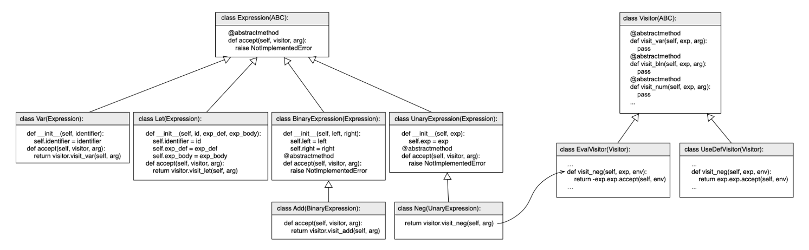

# Visitors
### Overview

The goal of this assignment is to use the [Visitor](https://en.wikipedia.org/wiki/Visitor_pattern) design pattern. To achieve this, you must implement two types of visitors:

- The first visitor (`EvalVisitor`) evaluates logical and arithmetic expressions. This visitor should produce the same results as the eval function implemented in previous exercises.

- the second visitor (`UseDefVisitor`) implements a simple [semantic analysis](https://en.wikipedia.org/wiki/Semantic_analysis_(compilers)) that determines whether an expression contains any variable that was used without being defined.

The Visitor pattern allows us to remove from the component itself (in our case, instances of `Expression`) the code that processes that component (in our case, the old `Expression.eval()` function). This way, we can have multiple operations implemented on instances of `Expression` without needing to modify those instances.

---
### Implementing the Visitors

The figure below illustrates how our software architecture will look once the pattern is implemented.




The Visitor pattern involves two parts: implementing the `accept` method for each type of component (instance of `Expression`), and implementing the concrete visitors. The first part has already been done for you. You do not need to modify the file `Expression.py`. However, it would be a good idea to open this file and read its code (after all, the Visitor pattern is important!). 

On the other hand, you will need to implement most of the file `Visitor.py`. One of the visitors declared in this file, `EvalVisitor`, already provides the method signatures. You must complete the body of these methods. The other visitor, `UseDefVisitor`, however, does not even provide the method signatures. You will need to implement all of these methods. Note that the two visitors have a similar structure.

In addition, you must implement a function `safe_eval(exp)` that evaluates logical and arithmetic expressions, but only if those expressions do not contain undefined variables. This function combines the two visitors you developed in this assignment. First, it uses `UseDefVisitor` to check whether there are undefined variables. If undefined variables exist, then the function prints the message below:

```
Error: expression contains undefined variables.
```

Otherwise, if the expression is valid, your function prints the message below, where XX is the value of the evaluated logical and arithmetic expression exp:

```
Value is XX
```
---
### Running and Testing

To complete this exercise, only Visitor.py is new and must be implemented by you. You must not modify driver.py. The other files, except for Expression.py, can be reused from the previous exercise. Expression.py is already done for you, and you must not modify this file. To test your implementation locally, you can use the command below:

```Bash
$> python3 driver.py
eval # this word defines the option that will be tested
2 + let v <- 3 in v * v end # press CTRL+D
Value is 11
```
The implementation of the different files contains several doctest comments that test your code. If you want to run the tests, simply execute:

```bash
python3 -m doctest xx.py
```
In the example above, replace xx.py with any of the files you want to test (try it with Expression.py, for instance). If no error messages are generated, then your work is (probably) complete!