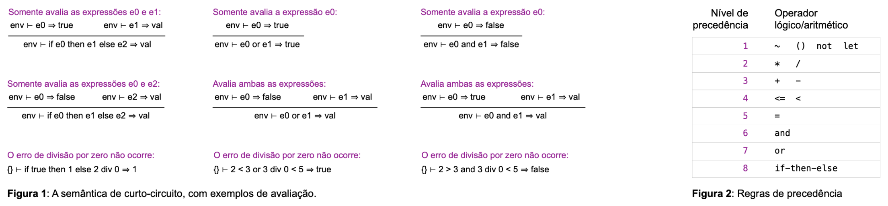
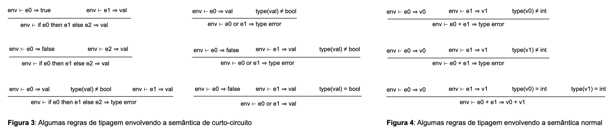

# Dinamic Type Checking

### Overview

The language we have been building so far is [dynamically typed](https://en.wikipedia.org/wiki/Type_system#Dynamic_type_checking_and_runtime_type_information). Examples of dynamically typed languages include Python, Ruby, PHP, and JavaScript. In dynamically typed languages, the types of expressions are discovered at runtime. However, this does not mean types do not exist! It should still be an error to try to evaluate expressions like `not 3` or `True < 4`.

The goal of this assignment is to add type checking to our arithmetic expression interpreter. Type checking will prevent operations such as `True + 3` or `not 3` from being executed. Instead of running these invalid operations, our interpreter will produce a type error (printing the message `"Type error"`).

To solve this exercise, you must extend the implementation from the previous exercise (Visitors) with two changes:

- Modify the grammar of the language by adding three new constructions: if-then-else, or, and and.

- Add type checking to the implementation of `EvalVisitor`.

---

### Grammar Changes

Three new constructs are added to the arithmetic expression language:

1. Conditional expressions:
    - `if cond then e0 else e1` 
    - This expression evaluates the condition cond. If it is true, the value of e0 is returned; otherwise, the value of e1 is returned.

2. Logical disjunction (or):
    - `e0 or e1`
    - This expression evaluates to true if either e0 or e1 evaluates to true; otherwise, it evaluates to false.

3. Logical conjunction (and):
    - `e0 and e1`
    - This expression evaluates to true if both e0 and e1 evaluate to true; otherwise, it evaluates to false.

These three constructs follow [short-circuit semantics](https://en.wikipedia.org/wiki/Short-circuit_evaluation). Short-circuit semantics is a code optimization that consists of evaluating only the minimum necessary part of a logical expression to obtain its value.  

For example, the expression `if true then e0 else e1` only evaluates the expression `e0`.  
Similarly, the expression `if false then e0 else e1` only evaluates the expression `e1`.  

See what would happen in our interpreter:
```bash
$ python3 driver.py
true or 1 div 0 = 3  # Press CTRL+D
True
```

```bash
$ python3 driver.py
1 div 0 = 3
1D  # division by zero!
```

```bash
$ python3 driver.py
1 div 0 = 3 or True
1D
```

Short-circuit semantics also occur in conjunctions and disjunctions, as illustrated in Figure 1.



In addition to adding the three new grammar constructs, we will change the grammar precedence rules.  
The new precedence rules must follow the priority table shown in Figure 2.  

For example:  
- `2 < 3 and 3 < 4` is equivalent to `(2 < 3) and (3 < 4)`.  
- `not if true then true else false` is a grammatically incorrect expression.  
- `not (if true then true else false)` has the value `false`.  

---

### Runtime Type Checking

Up to this point, our interpreter might execute "strange" programs, such as `true + 1`.  
If this happens, we may either get a Python exception (something like *"unsupported operand type(s) for +"*),  
or we may get the value `2` (since in Python, `true + 1 == 2`).  

To avoid this kind of behavior, we will add three types of error messages to our interpreter:

1. **Type error**: occurs when operations are applied to values of invalid types.  
2. **Def error**: occurs when we try to access a variable that has not been declared.  
3. **Parse error**: occurs when sentences are not grammatically correct.  

To emit an error message, use the command:

```python
sys.exit(msg)
```

This function is available in the [sys](https://docs.python.org/2/library/sys.html) package, where msg is the error message.

Errors of type (1) and (2) must be implemented in `EvalVisitor`, inside the file `Visitor.py`. The parse error must be implemented in `Parser.py`. 

Some typing rules can be found in Figures 3 and 4 below.



Note that to perform type checking, you can use Python itself, with calls to the functions `type(v)`, which returns the type of the value v, and `isinstance(v, t)`, which returns `True` if v is an instance of type t. But be careful, since Python has a rather permissive coercion system:

```Python
>>> type(True) == type(1)
False
>>> isinstance(True, int)
True
```

As an example, a type check can be seen below, for LEQ comparison expressions:

```Python
def visit_leq(self, exp, env):
        val_left = exp.left.accept(self, env)
        val_right = exp.right.accept(self, env)
        if type(val_left) == type(1) and type(val_right) == type(1):
            return val_left <= val_right
        else:
            sys.exit("Type error")
```

Below we see some examples of different **types** of errors:

```Python
python3 driver.py
not 1
Type error
```

```Python
python3 driver.py
not 1 < 2
Type error
```

```Python
python3 driver.py
if 1 then 3 else 4
Type error
```

Below we see some examples of **parsing** of errors:

```Python
python3 driver.py
1 + 2 +
Parse error
```
```Python
python3 driver.py
not if true then 1 else 2
Parse error
```

And finally below we see some examples of undefined variable errors.

```Python
python3 driver.py
let x <- 2 in x * x end + x
Def error
```

```Python
python3 driver.py
x * 2
Def error
```

---

### Submitting and Testing

To complete this assignment, you should **not** modify `driver.py`; nor will you need to modify `Expression.py`.  
You may use, as a starting point, the files available from the previous exercise (**Visitors**).  

To test your implementation locally, you can run:

```bash
$ python3 driver.py
2 + let v <- 3 in v * v end # Press CTRL+D
Value is 11
```

The implementation of the different files includes several doctest comments that automatically test your code.
If you want to run these tests, simply do:

```Python
python3 -m doctest xx.py
```

In the example above, replace xx.py with any of the files you want to test (try with Expression.py, for instance).
If no error messages are generated, then your work is (almost) complete!