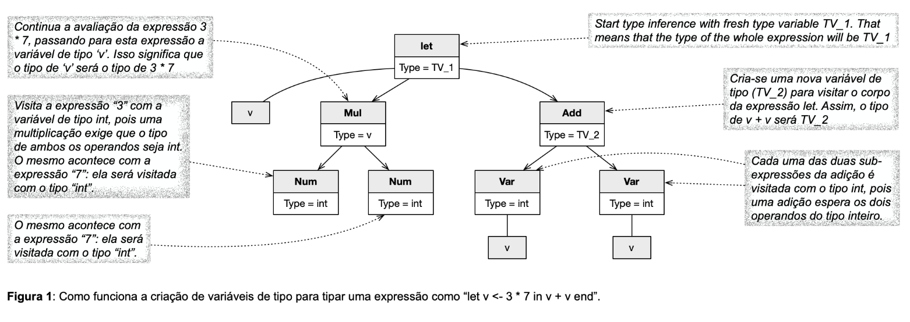
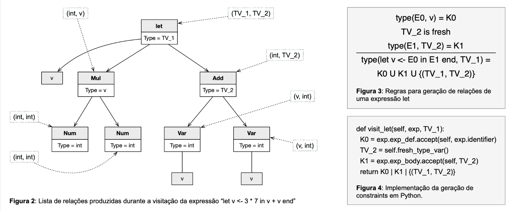

# Type Inference

### Overview

The goal of this assignment is to implement a [type inferencer](https://en.wikipedia.org/wiki/Type_inference) for our arithmetic expression language.
To achieve this, you will implement three algorithms:

1. **Constraint Generation**, implemented as a Visitor that traverses the abstract syntax tree (AST) and produces equivalence constraints.

2. **Constraint Unification**, merges constraints to group variables of the same type together.

3. **Type Naming**, assigns a concrete type name to each equivalence class.

---
### Constraint Generation

A constraint is an equivalence relation that specifies that two variables share the same type.
For example:

`('TV_1', 'v')` means variable v and the type variable TV_1 have the same type.

`('v', <class 'int'>)` means variable v has type int.

You must implement a subclass of **Visitor** called **CtrGenVisitor** that traverses the AST and produces a set of equivalence relations.

Example:

```Bash
>>> e = Let('v', Num(40), Let('w', Num(2), Add(Var('v'), Var('w'))))
>>> ev = CtrGenVisitor()
>>> sorted([str(ct) for ct in e.accept(ev, ev.fresh_type_var())])
["('TV_1', 'TV_2')",
 "('TV_2', 'TV_3')",
 "('v', <class 'int'>)",
 "('w', <class 'int'>)",
 "(<class 'int'>, 'TV_3')",
 "(<class 'int'>, 'v')",
 "(<class 'int'>, 'w')"]

```
Each visitor method follows the signature:

```Python
visit_var(self, exp, type_var)
```
- **exp** is the expression currently being analyzed.
- **type_var** is the type variable representing the type of **exp**.

For example, for the expression:

```Vbnet
let v <- 3 * 7 in v + v end
```

the visitor produces the following equivalences:

```pgsql
{(int, v), (TV_1, TV_2), (int, int), (int, int), (int, TV_2), (v, int), (v, int)}
```
Here, **TV_1** and **TV_2** are type variables created to unify the types of subexpressions.
To determine the type of **v**, these relations must be unified.

The figures below (Figures 1–4) illustrate the process of generating equivalence relations for this expression:







---
### Constraint Unification

Unification determines which variables share the same type by grouping them into sets.
You must implement the function **unify** in the file **Unifier.py**.

Unification builds a **map of variables to sets**, where each set contains all variables of equivalent types.

Example:

```Python
>>> type_sets = unify(
...   [('a', 'TV_1'), ('b', 'TV_2'), ('TV_2', type(1)), ('TV_1', type(True))],
...   {}
... )
>>> for var, type_set in type_sets.items():
...     print(var, type_set)
...
a {<class 'bool'>, 'a', 'TV_1'}
TV_1 {<class 'bool'>, 'a', 'TV_1'}
b {'b', <class 'int'>, 'TV_2'}
TV_2 {'b', <class 'int'>, 'TV_2'}
<class 'int'> {'b', <class 'int'>, 'TV_2'}
<class 'bool'> {<class 'bool'>, 'a', 'TV_1'}
```
A practical trick for this step is to ensure that all references in **type_sets** point to the same Python set object when unified.

The figure below (Figure 5) illustrates how unification merges equivalent type sets:


---
### Naming Type Sets

Once type sets are unified, each set must be assigned a type name.
The name of a set is the concrete type it contains.

For example, if:

```ini
>>> type_sets = unify(
S1 = {a, TV_1, bool}
S2 = {b, TV_2, int}
```

Then:
- The name of **S1** is **bool**
- The name of **S2** is **int**

You must implement the function **infer_types**, which receives an expression and returns a **mapping from variables to type names**.

Example:

```Python
>>> e0 = Let('v', Num(1), Let('y', Var('v'), Var('y')))
>>> e1 = IfThenElse(Lth(e0, Num(2)), Bln(True), Bln(False))
>>> e2 = Let('w', e1, And(Var('w'), Var('w')))
>>> type_names = infer_types(e2)
>>> type_names['v']
<class 'int'>
>>> type_names['w']
<class 'bool'>
>>> type_names['y']
<class 'int'>
```

This dictionary may also include type variables and concrete Python types ``(e.g., <class 'int'>, <class 'bool'>)``.

---
### Error Handling

The function ``name_sets`` must also detect type errors.

A type error occurs when:

- Polymorphic type: A set contains no primitive types (**int** or **bool**).

- Ambiguous type: A set contains both **int** and **bool**.

In both cases, the program must abort and print:

```Python
Type error
```

(without a period).

---
### Running the Program

You must **not** modify ``driver.py``.
The only files you need to edit are ``Visitor.py`` and ``Unifier.py``.

To test your implementation locally, run:

```Bash
python3 driver.py
```

Then type an expression such as:

```Bash
2 + let v <- 3 in v * v end
```
Press ``CTRL+D`` to end input.

Expected output example:

```Python
Type(v): int
Type(w): NoneType
Type(x): NoneType
Type(y): NoneType
Type(z): NoneType
```

Notes:

- Only variables ``v``, ``w``, ``x``, ``y``, and ``z`` are checked for types.

- If a variable does not exist in the program, it will be printed as ``NoneType``.

- Programs do not redefine variables: each ``let`` introduces a unique name.

Each source file includes embedded doctests that validate your implementation.
To run them, use:

```Bash
python3 -m doctest <filename>.py
```
For example:

```Bash
python3 -m doctest Visitor.py
```

If no error messages are produced, your implementation is (almost) complete!