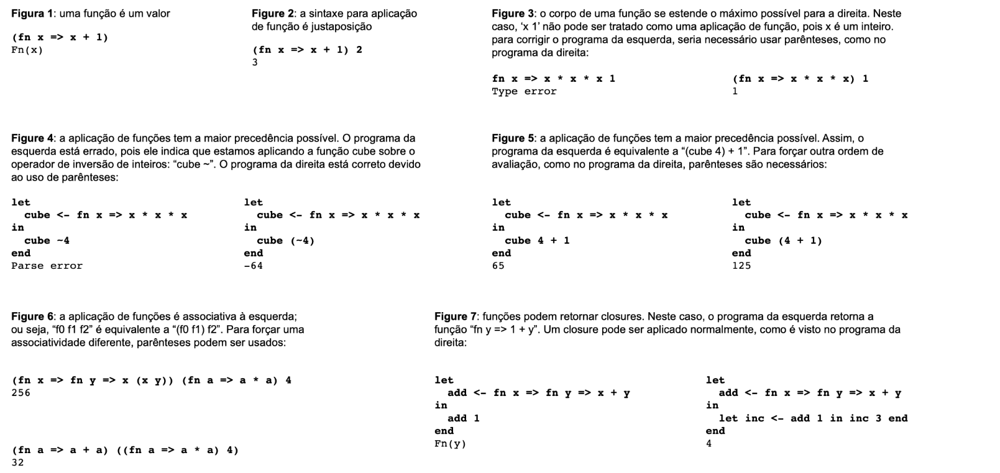
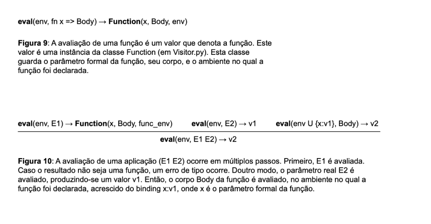
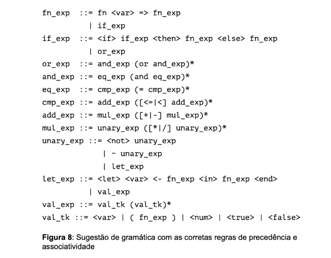

# Anonymous functions

### Overview
The goal of this assignment is to add [anonymous functions](https://en.wikipedia.org/wiki/Anonymous_function) to our programming language.
An anonymous function is a function definition not bound to any variable name.

This modification greatly increases the expressiveness of the language, for example, it allows the creation of [closures](https://en.wikipedia.org/wiki/Closure_(computer_programming)).

The figures below illustrate some example programs that can now be written using anonymous functions:



---
### Implementation

The addition of anonymous functions requires several changes to the implementation.
Two new syntactic categories must be introduced:

- Functions (Fn)

- Function applications (App)

These changes affect the lexer, the parser, and the interpreter.
The main modifications are detailed below.

**1. Expressions**

Two new expression types must be added to Expression.py:

- Fn: represents anonymous functions.

- App: represents function applications.

**2. Interpreter**

The visitor class EvalVisitor (in Visitor.py) must be modified to handle both anonymous functions and function applications.

The semantic rules for these new constructs are shown in the figures below:



**3. Lexical Analysis**

The lexer (``Lexer.py``) must be updated to include two new tokens:

The reserved word fn

The arrow =>

The ``getToken`` method must be extended to recognize and return these tokens.

For example, the function:

```php
fn a => a + 1
```
will produce the following tokens:

```css
FNX, VAR, ARW, VAR, ADD, NUM
```

**4. Syntax Analysis**

The parser (``Parser.py``) must be extended to include function declarations and function applications.

Rules of precedence and associativity:

- Function declarations have the lowest precedence.

- Function applications have the highest precedence.

- Function application is left-associative.

Examples:

```php
fn x => x + 1          → (fn x => x + 1)
f g + 1                → ((f g) + 1)
f0 f1 f2               → ((f0 f1) f2)
```

Note that there is no precedence difference between function application and unary operations:

```nginx
f ~1     → syntax error
f (~1)   → valid
```

The figure below provides a suggested grammar construction:




---
### Submission and Testing

You must **not** modify ``driver.py``.

To test your implementation locally, run:

```Bash
python3 driver.py
(fn x => x * x) (4 - 1)
# press Ctrl+D
```
Expected output:
```Bash
a
```

You can also run the built-in doctests included in the files:
```Bash
python3 -m doctest filename.py
```

For example:
```Bash
python3 -m doctest Visitor.py
```
If no errors are reported, your implementation is (almost) complete.