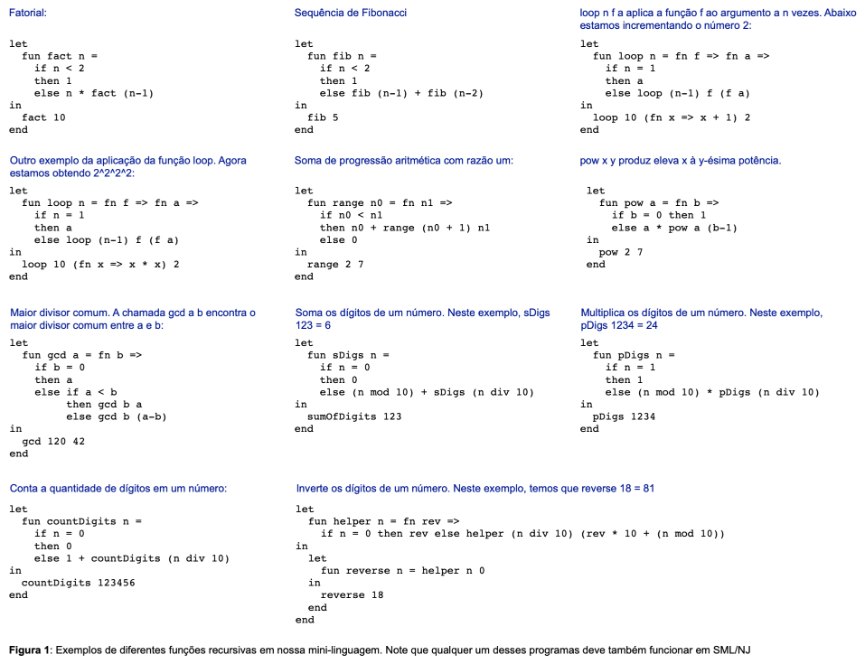
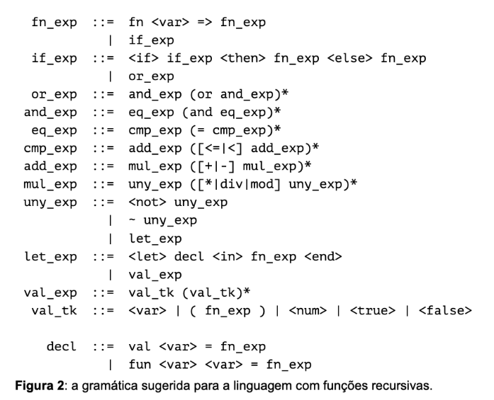
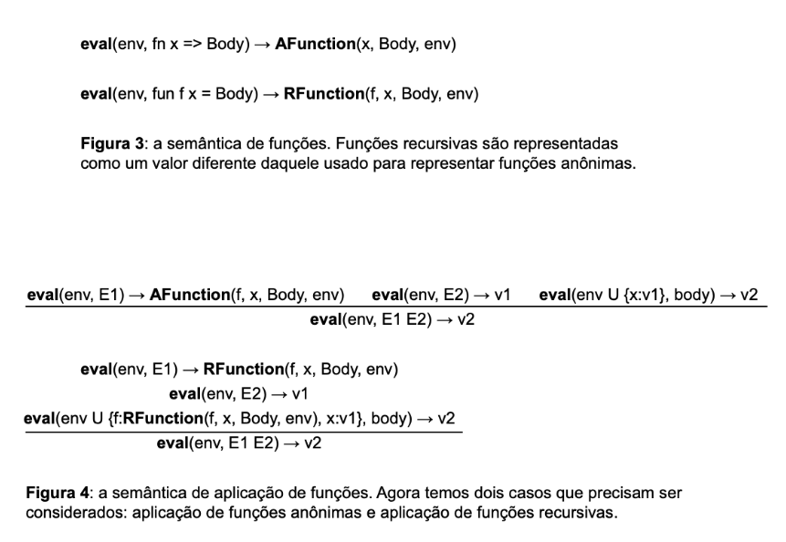

# Recursive Functions

### Overview

The goal of this assignment is to add recursive functions to our mini-language.
We will also make a few grammar adjustments so that our language becomes a subset of [Standard ML (SML).](https://en.wikipedia.org/wiki/Standard_ML)

With these changes, we will be able to write more complex and expressive programs.

The figure below illustrates some example programs that can be written using recursive functions:



---
### Implementation
Adding recursion to the programming language requires several changes to the version that currently only supports anonymous functions.
In addition, we will modify the grammar and add division and modular arithmetic operators so that all examples can run correctly.

The required changes are described below.

**1. Lexical Analysis**

The lexer (``Lexer.py``) must be modified to include:

-  Tokens for function declarations

- Tokens for division and modular arithmetic

- Tokens for variable declarations

Required modifications

1. Division operator

    - Replace the previous / operator with the reserved word div.

    - This makes our mini-language compatible with SML/NJ.

2. Modulo operator

    - Add a new operator mod.

    - Both 7 div 3 = 2 and 7 mod 3 = 1 should be valid sentences.

3. Variable declarations

    - Add two new keywords: val and fun.

    - val declares a variable.

    - fun declares a function.

The file ``Lexer.py`` already contains the list of tokens to be used.
You will need to update the getToken function implementation accordingly.

**2. Syntax Analysis**

The parser (``Parser.py``) must be modified to support function declarations and function applications.

The suggested grammar can be found in Figure 2:



**Grammar modifications**

- Addition of division and modulo operators via the reserved words div and mod.

- Function and variable declarations must now be prefixed with the reserved words fun and val.

- Replace the assignment operator <- with the equality symbol =.

**Precedence and associativity rules**

As in the assignment involving only anonymous functions:

- Function declarations have the lowest precedence.

- Function applications have the highest precedence.

- Function application is left-associative.

Examples:

```php
fn x => x + 1          → (fn x => x + 1)
f g + 1                → ((f g) + 1)
f0 f1 f2               → ((f0 f1) f2)
```

There is **no precedence difference** between function application and unary operations:

```nginx
f ~1     → syntax error
f (~1)   → valid
```

**3. Expressions**

The language now supports four types of values:

- Num – Numbers

- Bln – Booleans

- Fn – Anonymous functions

- Fun – Named functions

Additionally, a new expression type ``Mod`` implements modular arithmetic.
This enhancement increases expressiveness and is unrelated to recursion itself.

The file ``Expression.py`` already contains all necessary class definitions.
You may use it as provided, though you are free to modify it if you find it useful.

**4. Interpreter**

The visitor class ``EvalVisitor`` (in ``Visitor.py``) must be modified to interpret recursive functions, in addition to anonymous functions.

The semantic rules for both kinds of functions are shown below:



Your new implementation of ``EvalVisitor.visit_app`` must handle two cases, as seen in Figures 3 and 4:

```Python
def visit_app(self, exp, env):
    fval = exp.function.accept(self, env)
    if isinstance(fval, Function):
        return None  # handle the anonymous function case
    elif isinstance(fval, RecFunction):
        return None  # handle the recursive function case
    else:
        sys.exit("Type error")
```

---
### Submission and Testing
You must **not** modify ``driver.py``.

To test your implementation locally, run:

```Bash
python3 driver.py
```

Then type the following program:

```sml
let
  fun helper n = fn rev =>
    if n = 0
    then rev
    else helper (n div 10) (rev * 10 + (n mod 10))
in
  let
    fun reverse n = helper n 0
  in
    reverse 18
  end
end
# Press CTRL+D
```

Expected output:
```bash
81
```
Each file contains doctests that validate your implementation.

To run them, use:
```bash
python3 -m doctest filename.py
```
For example:
```bash
python3 -m doctest Visitor.py
```

If no error messages are displayed, your implementation is (almost) complete.