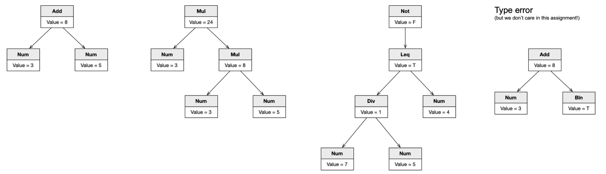

# Arithmetic Expression Representation

### Overview
In order to be evaluated, an arithmetic expression such as `2 + 3 * 4` needs to be represented as a data structure.  
The most natural way to do this is by using a **tree**, which allows us to capture the recursive nature of expressions.  
By *recursive nature*, we mean that an expression can be composed of sub-expressions.  
- **Unary nodes** represent expressions with only one sub-expression, such as `-2` or `Not(True)`.  
- **Binary nodes** represent expressions formed by two sub-expressions, such as `2 + 3` or `4 * (5 - 2)`.  

This representation allows us to interpret an expression. In an arithmetic expression language, the interpretation of an expression is its value.  

- If an expression is a number, then its value is that number.  
- If an expression is an addition, then its value is the sum of its sub-expressions.  

The figure below illustrates some expressions and their values:



---
### The Exercise

In this assignment, you must implement the representation of arithmetic expressions.  

We will use the [Composite design pattern](https://en.wikipedia.org/wiki/Composite_pattern). According to this pattern, any node that represents an expression must provide the same interface.  
Here, the interface is the method `eval()`, which returns the value of the expression.  

In other words, expressions are instances of subclasses of the following abstract class:

```python
class Expression(ABC):
    @abstractmethod
    def eval(self):
        raise NotImplementedError
```
---
### Language Specification
The exercise defines a hierarchy of expressions, based on the [Cool](https://theory.stanford.edu/~aiken/software/cool/cool-manual.pdf)  programming language.
We will work with the following subset of expressions:

```bash
expr ::= expr + expr
       | expr - expr
       | expr * expr
       | expr / expr
       | expr < expr
       | expr <= expr
       | expr = expr
       | not expr
       | (expr)
       | integer
       | true
       | false
```
---
### Running the Program
To complete this exercise, you must implement the `eval()` method in each concrete expression class.  

Do **not** modify `driver.py`. It is only provided so that you can test your exercise locally.  

To run the driver, use:

```bash
$ python3 driver.py

Add(Num(3), Num(5))   # this is what you could type, then press CTRL+D to signal EOF to the driver
Value is 8
```

The implementation of Expression.py contains several doctest comments that validate your implementation.

To run these tests, simply use:

```bash
$ python3 -m doctest Expression.py
```

If no error messages are produced, your work is complete!