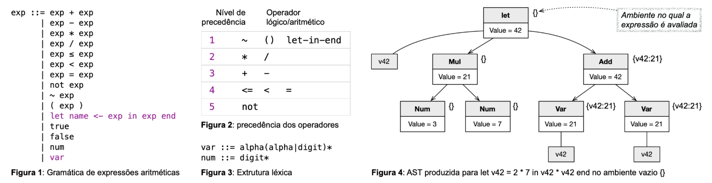

# Arithmetic Expression with Variables
### Overview

The goal of this exercise is to extend our arithmetic expression language by **adding support for variables**, through the introduction of **let blocks**.

---
### Let Blocks: Syntax and Semantics

A let block has the following syntax:

```bash
let var <- exp0 in exp1 end
```

The value of a let block is the value of exp1, but in an environment where the name "var" has the value of exp0. For example, the following equalities are all true:

```bash
let x <- 1 in x end = 1

let x <- 2 in x * x end = 4

let x <- 3 in let y <- 4 in let z <- 6 in (x + y) * z end end end = 42
```

Adding let blocks to our language changes the grammar of arithmetic expressions in two ways. These two modifications are highlighted in Figure 1.



Note that let blocks have high precedence. In other words, an expression like `let v <- 3 in v + v end * 2` has the value 12, just like the expression `2 * let v <- 3 in v + v end`. 

Figure 2 above shows the relative precedence between the different lexemes of our language. Also note that let blocks exist in the [Cool](https://theory.stanford.edu/~aiken/software/cool/cool-manual.pdf) language, however, in that language these blocks do not have the keyword end at the end (as can be seen on page 16 of the language manual). In our case, the final `end` simplifies the lexical analysis of the language.

---
### Environments and Expression Evaluation

The addition of let blocks to the language will force us to modify the three files from the previous exercise. As can be seen in Figure 3 above, we now have to recognize "variable names". Variable names are sequences that start with a letter (uppercase or lowercase) and continue with letters or digits. A much more important modification, however, occurs in the evaluation of arithmetic expressions. In this case, expressions are evaluated within an environment. The environment is a table that maps variable names to values. In other words, our interface for Logical and Arithmetic Expressions now becomes the following:

```Python
class Expression(ABC):
    @abstractmethod
    def eval(self, env):
        raise NotImplementedError
```

The evaluation of a variable, in a given environment `env`, is the value associated with the variable’s name. You can implement env as a dictionary in Python. Thus, the value of a variable `"x"` is `env["x"]`. Note that it is an error to evaluate a variable in an environment that does not contain a definition for its name. In this case, your interpreter must abort the evaluation process, printing the following message:

```bash
Variavel inexistente {nome_da_variável}
```

Note that the word Variavel must be printed without an accent! As an example, consider the calls below:

```Python
>>> e = Var('var')
>>> e.eval({'var': 42})
42

>>> e = Var('v42')
>>> e.eval({})
Variavel inexistente v42
```
---
### Running the Program

To complete the exercise, you must modify the implementations of three files from the previous exercise: Lexer.py, Expression.py, and Parser.py. And you must not change driver.py. It is available so that you can test your exercise locally. To do so, you can use the command below:

```bash
python3 -m doctest xx.py
```
In the example above, replace xx.py with one of the files you need to modify. If no error messages are generated, then your work is (probably) complete!
