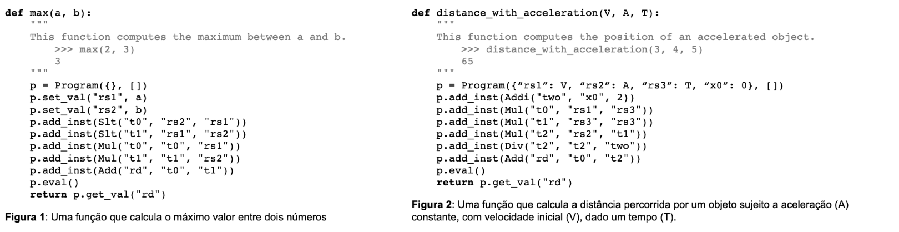
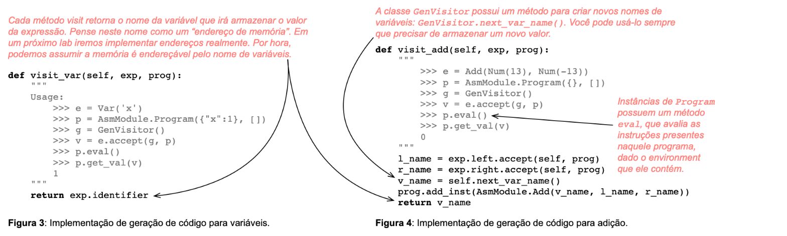

# Code for arithmetic expressions

### Overview

The goal of this assignment is to compile logical and arithmetic expressions to a subset of [RISC-V](https://en.wikipedia.org/wiki/RISC-V) instructions.

For now, we will consider a machine with only the following nine instructions:

```
- add rd, rs1, rs2 → rd = rs1 + rs2

- addi rd, rs1, imm → rd = rs1 + imm

- mul rd, rs1, rs2 → rd = rs1 * rs2

- sub rd, rs1, rs2 → rd = rs1 - rs2

- xor rd, rs1, rs2 → rd = rs1 ^ rs2

- xori rd, rs1, imm → rd = rs1 ^ imm

- div rd, rs1, rs2 → rd = rs1 // rs2 (signed integer division)

- slt rd, rs1, rs2 → rd = (rs1 < rs2) ? 1 : 0 (signed comparison)

- slti rd, rs1, imm → rd = (rs1 < imm) ? 1 : 0
```

This assignment provides an emulator for these instructions in ``Asm.py``.
You **do not need to modify** this file, but it is useful to read the code to understand how instructions are implemented.

Two example functions, ``max`` and ``distance_with_acceleration``, demonstrate how to create new instructions. These examples are illustrated in Figures 1 and 2 below.

Note: RISC-V has a special register ``x0`` which always contains zero. You can use it to build more complex instructions from the available ones.
Example: To set a variable ``"a"`` to ``2``, you can use:
``addi("a", "x0", 2)``



---
### Supported Expressions

You will generate code for the following expressions (from Lab 5 – Visitors):
```
- Variables: Var("x")

- Booleans: Bln(True)

- Numbers: Num(2)

- Equality: Eql(Exp0, Exp1)

- Addition: Add(Exp0, Exp1)

- Multiplication: Mul(Exp0, Exp1)

- Subtraction: Sub(Exp0, Exp1)

- Division: Div(Exp0, Exp1)

- Less than or equal: Leq(Exp0, Exp1)

- Less than: Lth(Exp0, Exp1)

- Negation of numbers: Neg(Exp)

- Boolean negation: Not(Exp)

- Variable creation: Let("x", Exp0, Exp1)
```

You can assume that all variable names in a program are unique.

---
### Code Generation

To generate RISC-V code, you must implement a Visitor called ``GenVisitor``.

- Each ``visit`` method receives an expression and a ``Program`` instance.

- The method returns the name of the variable storing the expression's value.

- ``Program`` is defined in ``Asm.py``.

To add an instruction, use: ``Program.add_inst``.

Some expressions (like ``Add``) map directly to available RISC-V instructions.
Others (like ``Not`` or ``Eql``) do not have a direct instruction, so you must implement them using the available instructions.

Figures 3 and 4 illustrate example visit methods and their compilation logic:



As mentioned above:

- You can assume that all variables in ``let`` blocks have unique names.

- Invalid example (duplicate variable names):

```sml
let x <- 1 in let x <- 2 in x end + x end
```

- Valid example:
```sml
let x0 <- 1 in let x1 <- 2 in x1 end + x0 end
```

In the next lab, we will implement a visitor to automatically rename variables.

---
### Submission and Testing

You must **not** modify ``driver.py`` or ``Expression.py``or ``Asm.py``.

To test your implementation locally, run:

```Bash
python3 driver.py
```

Example program:

```sml
2 + 3
# Press CTRL+D
```

Expected output:
```Bash
5
```

Each file contains doctests that validate your implementation.
To run them, use:
```bash
python3 -m doctest filename.py
```

For example:

```bash
python3 -m doctest Visitor.py
```

If no errors appear, your implementation is (almost) complete!