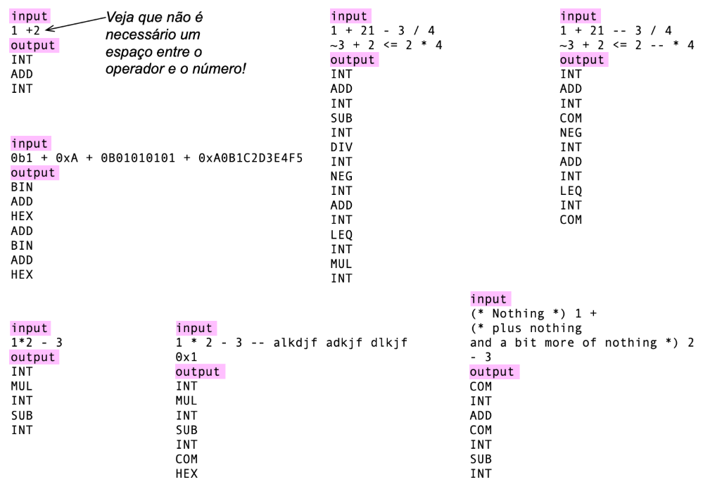

# Lexical Analysis

The objective of this assignment is to implement a lexical analyzer for a subset of the [cool](https://theory.stanford.edu/~aiken/software/cool/cool-manual.pdf) language, which describes arithmetic expressions (see Section 7.12 of the manual). Your analyzer should recognize the following tokens:

1.  `EOF`: End of file
2.  `NUM`: Newline
3.  `WSP`: Whitespace
4.  `COM`: Comment
5.  `EQL`: Equal sign (`=`)
6.  `ADD`: Addition sign (`+`)
7.  `SUB`: Subtraction sign (`-`)
8.  `MUL`: Multiplication sign (`*`)
9.  `DIV`: Division sign (`/`)
10. `LEQ`: Less than or equal to (`<=`)
11. `LTH`: Less than (`<`)
12. `NEQ`: Unary minus sign
13. `NOT`: boolean negation (`not`) 
14. `LPR`: Left parenthesis
15. `RPR`: Right parenthesis
16. `TRU`: Boolean constant "true"
17. `FLS`: Boolean constant "false"
18. `INT`: Integer numbers `0 | (1|2|3|4|5|6|7|8|9)(0|1|2|3|4|5|6|7|8|9)*`  
19. `BIN`: Binary numbers `0(b|B)(0|1)*`
20. `OCT`: Octal numbers `0(0|1|2|3|4|5|6|7|8|9)+`
21. `HEX`: Hexadecimal numbers `0(x|X)(0|1|2|3|4|5|6|7|8|9|A|B|C|D|E|F)*` 

Comments can be of two types:
- **Line comment**: starts with a double minus (`--`). A line comment causes the rest of the line to be ignored.  
- **Block comment**: text enclosed between `(*` and `*)`. All text between these markers must be ignored.  

---

### Implementation

Part of the implementation is already provided. You must reuse the token definition (`TokenType` class) and the token implementation (`Token` class).  
Your goal is to implement the `Lexer` class. This class is a token generator. The token generation method is shown below:

```python
def tokens(self):
    token = self.getToken()
    while token.kind != TokenType.EOF:
        if token.kind != TokenType.WSP and token.kind != TokenType.NLN:
            yield token
        token = self.getToken()
```

Note that the token generator returns any type of token, except whitespaces and comments.

Your code will be tested with the following driver:

```python
if __name__ == "__main__":
    lexer = Lexer(sys.stdin.read())
    for token in lexer.tokens():
        print(f"{token.kind.name}")
```

In other words, the tests shown in the figure below must work:



Part of the work is already implemented for you. You must work on two files: `Lexer.py` and `driver.py`. You do not need to modify anything in `driver.py`.
