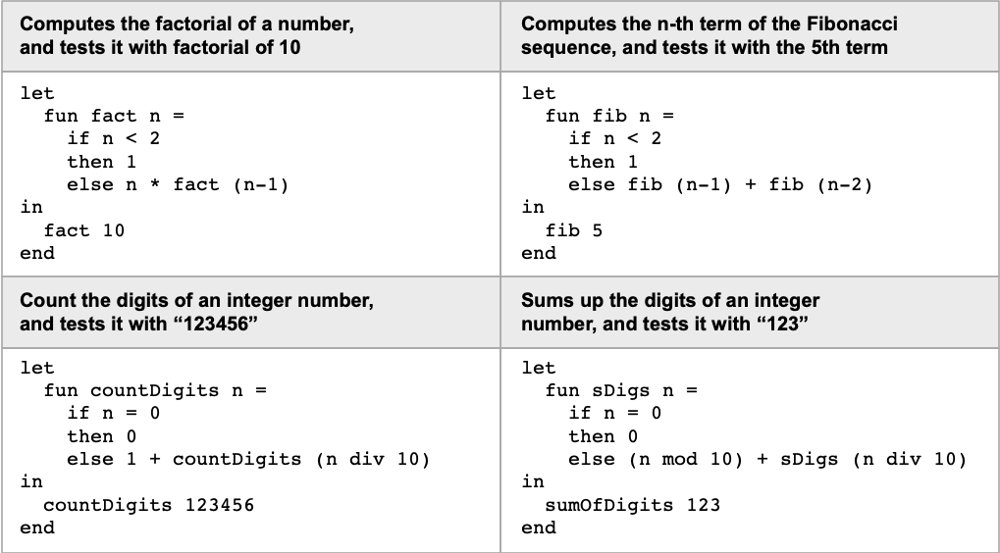
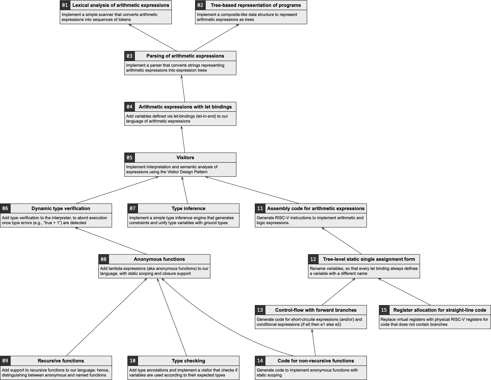

# DCC053 - Compiler Construction - UFMG

## Project Assignment

### Description

**DCC053 (Compiler Construction)** is a project-oriented course where students will implement two distinct methods for executing a subset of [Standard ML of New Jersey (Wikipedia)](https://en.wikipedia.org/wiki/Standard_ML_of_New_Jersey), a functional programming language.

* The first method is a **tree-based interpreter**.
* The second is a **code generator** that produces **RISC-V instructions**.

These methods differ in capability:

* The **interpreter** will handle *closures* and *recursive functions*,
* The **code generator** will handle *anonymous functions* but **not** *recursive functions*.

By the end of the project, students will be able to interpret functions like the examples shown below.



The project will be implemented in **Python** and graded through **UFMG’s Moodle** system. It consists of **15 deliverables**, each comprising a set of Python programs that together provide some functionality of our “MiniSML.”

There are dependencies between deliverables, but the longest dependency chain involves only eight deliverables. This allows students to complete substantial parts of the project even if earlier ones are unfinished.

Each deliverable includes **partially completed code** that students must complete. While students have freedom in how to fill in the missing parts, they must work within the **provided Python modules** — no adding or removing files.

Some subprojects will require modifying earlier deliverables, allowing students to practice skills such as **grammar refactoring**. For example:

* The precedence of the unary `not` operator evolves during the project.
* The syntax for declaring variables changes over time.



---

## Educational Goals

The compiler construction project for DCC053 provides a **hands-on learning experience** in both theory and practice. Over **15 weeks**, students will progressively build a compiler for a subset of Standard ML of New Jersey to achieve the following goals:

### 1. Understanding Compiler Theory

* **Type Checking and Type Inference**
  Students will learn the foundations of type systems and how to ensure program correctness.

* **Syntax and Semantics**
  Students will gain an understanding of parsing, syntax trees, and semantic analysis.

### 2. Learning Compiler Engineering

* **Program Representation**
  Represent programs internally using Abstract Syntax Trees (ASTs) and related structures.

* **Code Generation**
  Translate high-level constructs into **RISC-V assembly**.

* **Register Allocation**
  Learn the challenges of managing processor registers efficiently.

* **Recursive Functions and Closures**
  Implement support for advanced constructs and learn the complexities involved.

### 3. Applying and Reinforcing Concepts

* **Gradual Development**
  Apply theoretical concepts through weekly deliverables.

* **Incremental Changes**
  Adapt to evolving implementation requirements, such as operator precedence or syntax rules.

### 4. Practical Experience

* **Iterative Design**
  Engage in iterative design and development cycles.

* **Debugging and Optimization**
  Develop debugging and performance-tuning skills.

By completing these deliverables, students gain both theoretical and practical compiler construction skills, applying classroom knowledge to a working compiler project.

---

## How to Approach the Project

Each deliverable contains several Python files. You can test them locally using **doctests**.
Example for `Expression.py`:

```bash
python3 -m doctest Expression.py
```

Initially, these tests will fail — that’s expected. Start by reading the test cases carefully and implement code **incrementally** until all tests pass.

Submissions are made through **Moodle**, and you may submit **multiple times**. Moodle runs a comprehensive set of tests per deliverable. If some tests fail, you can:

* Fix them and resubmit, or
* Move on to other deliverables.

Some tests are **weighted less**, so a few failures won’t ruin your grade.

You’re encouraged to use a [Test-Driven Development (Wikipedia)](https://en.wikipedia.org/wiki/Test-driven_development) approach:

* Tests are already provided — use them to guide your implementation.
* Incrementally satisfy each test to build a robust compiler step by step.

---

## And Don’t Feel Overwhelmed...

Building a compiler may seem daunting, but remember:

* You’re **not alone** — you’ll have the tools, [lectures](https://homepages.dcc.ufmg.br/~fernando/classes/dcc053/), and support you need.
* Each of the 15 deliverables is **small and focused** on a specific task.
* Most of the necessary code and concepts are **covered in class**.

You can consult resources like **LLMs (e.g., ChatGPT)** for clarification, but make sure **your submitted work is your own** to fully benefit from the learning process.

Each deliverable includes its own **set of tests** to help you verify correctness and progress.
Even if you don’t pass all the tests on your first try, you can:

* Earn **partial credit**, and
* Continue working on independent parts of the project.

The deliverables form a **partially ordered set**, so you can progress even if earlier tasks are incomplete.

> **Tip:** Take one step at a time. Each small success builds toward a working compiler.

The skills gained — persistence, debugging, design, and reasoning — will be **invaluable** academically and professionally.