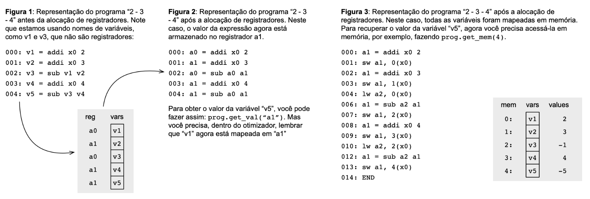

## Register Allocation for Linear Code

### Overview

The goal of this assignment is to implement a [register allocator](https://en.wikipedia.org/wiki/Register_allocation) for [linear code](https://en.wikipedia.org/wiki/Basic_block).

Linear code contains no branches, conditional or otherwise. In compiler terminology, such programs are called basic blocks.

This exercise builds on VPL 11 (code generation for logical and arithmetic expressions). In that lab, you generated code that allocated values to variables. You could always create a new variable name.

This time, your instructions have a **fixed number of registers**. If the number of values exceeds the number of available registers, you must allocate the excess values in memory.

---
### Available Registers
Your program now has the following registers:
| Register | Description |
|----------|-------------|
| x0       | Always contains zero. Writing to it has no effect. |
| sp       | Stack pointer, initialized to memory size. Not used in this exercise, but do not write to it. |
| ra       | Return address register. Not used here. Avoid writing to it. |
| a0       | First general-purpose register. Use freely. |
| a1       | Second general-purpose register. Use freely. |
| a2       | Third general-purpose register. Use freely. |
| a3       | Fourth general-purpose register. Use freely. |

--- 

### Available Registers
If you run out of registers, you can map values to memory using load and store instructions:
- Store value:
```Python
sw reg, rs1(offset)  # store val(reg) at memory[ val(rs1) + offset ]
```
- Load value:
```Python
ld reg, rs1(offset)  # load memory[ val(rs1) + offset ] into reg
```
Memory is modeled as an array of 32-bit integers. Examples:

```Python
Sw("sp", -1, "a")  # mem[val(sp) - 1] := val(a)
Lw("sp", 0, "b")   # val(b) := mem[val(sp)]
Sw("x0", 7, "a")   # mem[7] := val(a)
Lw("x0", 7, "b")   # val(b) := mem[7]
```
---
### Task

To complete this assignment, you must:

1. Reuse the implementations of ``RenameVisitor`` and ``GenVisitor`` (from Visitor.py, VPL 12).

2. Implement a new class: ``RegAllocator`` (in ``Optimizer.py``).

The ``RegAllocator`` class should implement three methods:

- ``__init__(self, prog)``

    Initialize data structures related to register allocation.

- ``optimize()``

    Replace instructions in prog with new instructions that use only available registers and memory addresses.

- ``get_val(var)``

    Return the location of the variable ``var``. After optimization, ``var`` may be mapped to a register or a memory address.

The figures below illustrate how a variable’s value can be retrieved after register allocation:


---
### Submission and Testing

This assignment builds on VPL 12.

Do not modify ``Asm.py``, ``driver.py``, or ``Expression.py``.

To test your implementation locally, run:

```Bash
python3 driver.py
```

Example program:

```sml
1 + 2
# Press CTRL+D
```

Expected output:
```Bash
3
```

Each file contains doctests that validate your implementation.
To run them, use:
```bash
python3 -m doctest filename.py
```

For example:

```bash
python3 -m doctest Visitor.py
```

If no errors appear, your implementation is (almost) complete.